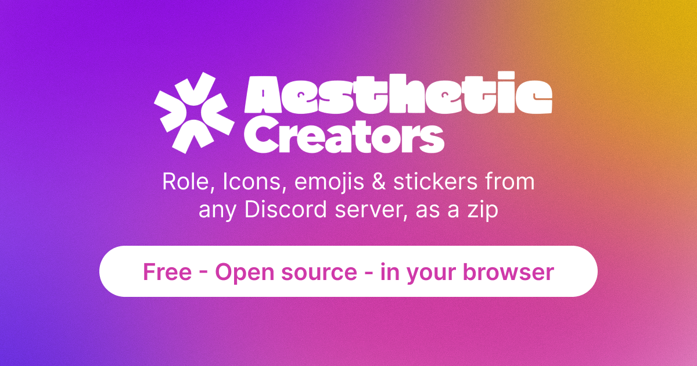

# Role Icon Downloader

**Download role icons, emojis, stickers and server images from any Discord server, as a ZIP.**

---

## Features

- **Role icons, emojis, stickers** and the **server icon, banner and invite splash**
- **Preview and select** what you want, with a **search by name**
- **Download everything as a ZIP** with a progress bar, or **a single image** (or copy its link)
- Choose the **image size** (64 to 1024 px) and the **file names** (name, ID or both)
- Animated emojis and stickers are exported as **GIF**
- Server list with **icons**, English and French interface (EN / FR button)
- A built-in **message builder** (Discord **Components V2**, or classic embeds) with live preview, select menus, JSON import, saved templates and share links: export the **JSON** or **discord.js** code, or send it with a **webhook**
- A **role icon maker**: pick a shape, colors and a symbol, then export a PNG
- Works with a **Discord account token**, a **bot token**, or a **manual JSON** (no token at all)

## How to use

1. Open **[the tool](https://zhaak63.github.io/Role-Icon-Downloader/)**.
2. Choose what to download: role icons, emojis, stickers, or server images.
3. Paste your token (a step-by-step guide is built into the page), or use the **Manual JSON** tab.
4. Click **Load servers**, pick a server, then **Show**.
5. Select the items, choose the size, and click **Download ZIP**.

> **Manual JSON mode:** make a `GET https://discord.com/api/v10/guilds/SERVER_ID` request yourself and paste the response. The page never needs your token this way.

## Security and privacy

- Everything runs **in your browser**. Your token is **never stored**, is only sent to `discord.com`, and disappears when you close the tab. Nothing goes through a server of ours.
- The whole tool is a **single file**, [`index.html`](index.html), so you can read it yourself.
- A user token gives access to your **entire account**. Never share it with anyone, and never paste code in your console that you don't understand.
- Using a user token outside the Discord app goes against Discord's Terms of Service. Use it at your own risk, or use a bot token or the manual JSON mode instead.

## Good to know

- Role icons only exist on servers with **boost level 2 or higher**.
- Roles that use a standard emoji instead of an image can't be downloaded (they are only listed).
- **Lottie** stickers can't be converted to an image and are skipped.

## Host your own copy

1. Fork this repository.
2. Go to **Settings > Pages**.
3. Choose **Deploy from a branch**, the `main` branch and the `/ (root)` folder, then **Save**.

## Community and support

Need help, found a bug or have an idea? Join the support server.

## Credits

Made by **Zhaak**. Inspired by [Discord Emoji Downloader](https://github.com/ThaTiemsz/Discord-Emoji-Downloader) by ThaTiemsz.

Solid icons in the role icon maker: [Phosphor Icons](https://phosphoricons.com) (MIT).

*This project is not affiliated with Discord Inc.*

---

<b>🇫🇷 Version française</b>

### Présentation

**Role Icon Downloader** récupère les **icônes de rôles, les emojis, les stickers** et les **images du serveur** (icône, bannière, image d'invitation) de n'importe quel serveur Discord, et les télécharge dans un ZIP.

### Fonctionnalités

- Aperçu, sélection et **recherche par nom**
- Téléchargement en **ZIP** avec barre de progression, ou **d'une seule image** (ou copie de son lien)
- Choix de la **taille** (64 à 1024 px) et du **nom des fichiers** (nom, ID ou les deux)
- Emojis et stickers animés exportés en **GIF**
- Liste des serveurs avec leurs **icônes**, interface en **français et en anglais**
- Fonctionne avec un **token de compte**, un **token de bot** ou un **JSON manuel** (sans token)

### Utilisation

1. Ouvre **[l'outil](https://zhaak63.github.io/Role-Icon-Downloader/)**.
2. Choisis ce que tu veux télécharger.
3. Colle ton token (un guide est intégré à la page) ou utilise l'onglet **JSON manuel**.
4. Clique sur **Charger les serveurs**, choisis un serveur, puis **Afficher**.
5. Sélectionne les éléments, choisis la taille et clique sur **Télécharger le ZIP**.

### Sécurité

- Tout se passe **dans ton navigateur** : ton token n'est **jamais enregistré**, il n'est envoyé qu'à `discord.com` et disparaît quand tu fermes l'onglet.
- Le code tient dans un seul fichier, `index.html`, que tu peux relire.
- Un token de compte donne accès à **tout ton compte** : ne le partage jamais.
- Utiliser un token de compte en dehors de l'application Discord va à l'encontre de ses conditions d'utilisation. Utilise-le à tes risques, ou passe par un token de bot ou le JSON manuel.

### Limites

- Les icônes de rôles demandent un serveur au **niveau 2 de boost** ou plus.
- Les rôles qui utilisent un emoji standard ne sont pas téléchargeables.
- Les stickers **Lottie** sont ignorés.

### Support

Une question, un bug ou une idée ? Rejoins le [serveur Discord de support](https://discord.gg/94seN7srjv).

